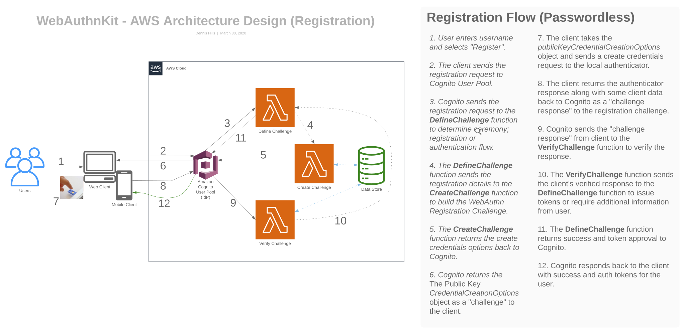

# Yubico WebAuthn Starter Kit

The WebAuthn Starter Kit is an Authentication and Authorization turnkey solution applying the best practices for strong authentication while providing ways to automate deployment of a serverless cloud-first solution that is repeatable, modularized, and scalable. 
 

## How it works 🔧 ##   

The starter kit solution utilizes Amazon Cognito User Pools as an identity provider with a custom User Pool Workflow consisting of four AWS Lambda functions, a WebAuthn Lambda function, and an Amazon API Gateway endpoint, providing registration, authentication, and authorization for an identifier-first type flow.

## Deliverable 📬 ##

The solution will be provided as an Amazon SAM template that includes the creation of a Amazon Cognito User Pool, coded AWS Lambda functions, an Amazon Aurora database, an Amazon API Gateway endpoint, and necessary permissions to create, execute, and delete these resources in your own AWS account.

## Backend Resources ##

These resources will be created, configured, and deployed in your own AWS environment using the provided [SAM template](https://github.com/YubicoLabs/WebAuthnKit/blob/master/backend/template.yaml). These services provide registration, authentication, WebAuthn Relying Party, and OPEN ID Connect provider solutions.

✅  One Amazon Cognito User Pool.

Cognito User Pools as an Identity Provider

## About Cognito User Pools ##

Amazon Cognito User Pools is a full-featured user directory managed AWS service that handles user registration, authentication, and account recovery. Amazon Cognito user pools implements ID, Access, and Refresh Tokens as defined by the OpenID Connect (OIDC) open standard.

Note :book: : User Pools provided tokens can be used to obtain temporary AWS credentials—with permissions you define—to access other AWS services directly or resources through Amazon API Gateway using Amazon Cognito Federated Identities (Identity Pool). 

The WebAuthn Starter Kit relies on Cognito User Pools to store user information and handle the custom registration and authentication flow. The kit can be used to leverage Cognito Federated Identities (identity pool) for fine-grain user access to other AWS resources.

✅  Four AWS Lambda Functions used as custom triggers with Cognito User Pool.

✅  One AWS Lambda Function [(Yubico Java WebAuthn Server Library)](https://github.com/Yubico/java-webauthn-server) as the WebAuthn Relying Party.

✅  One Amazon RDS Database - Aurora Serverless (MySQL-compatible database used to store user credential attributes).

✅  One Amazon API Gateway as our RESTful API endpoint.

## Backend

Deploy the backend as outlined in [backend](./backend/README.md).

## Clients ##

Once you build and deploy the backend, you can use one of the clients below to connect into the backend.

[Web Client (React)](https://github.com/YubicoLabs/WebAuthnKit/tree/master/clients/web/react)

[iOS Client (Swift)](https://github.com/YubicoLabs/WebAuthnKit/tree/master/clients/iOS)

## Cost Considerations ##

We have done our best to reduce the cost of running the Yubico WebAuthn Starter Kit on AWS, however, you are responsible the AWS service fees while running the WebAuthn Starter Kit reference deployment.

The WebAuthn Starter Kit utilizes an AWS SAM template for quick deployment. This template includes configuration parameters that you can customize to fit your needs and budget. Some of these settings, such as RDS Aurora database, affect the cost of deployment. For cost estimates, see the pricing pages for each AWS service used.

Cost Analysis: After you deploy the WebAuthn Starter Kit to your AWS environment, you can create a [AWS Cost and Usage Report](https://docs.aws.amazon.com/cur/latest/userguide/what-is-cur.html) to track costs associated with this deployment. This report will deliver billing metrics (cost estimates based on usage) to an Amazon S3 bucket in your own account.

## License Summary ##

This project is licensed under [Apache License 2.0](https://github.com/YubicoLabs/WebAuthnKit/blob/main/COPYING).
