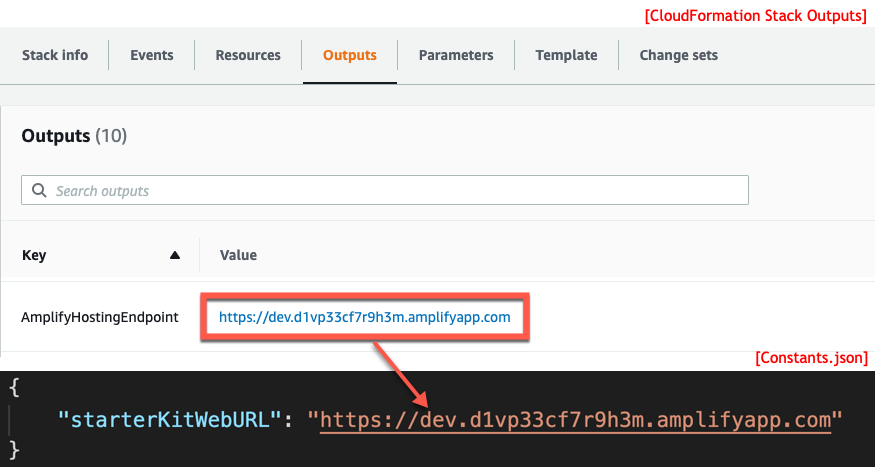

## About
WebAuthnKitSafari is a native iOS Swift Xcode project for demonstrating the built-in native Apple iOS (as of iOS 13.3) WebAuthn support via [SFSafariViewController](https://developer.apple.com/documentation/safariservices/sfsafariviewcontroller) from an native iOS Swift app.

## Get Started
1. Clone this repository
1. Change to WebAuthnKitSafari directory
1. Update the [`Constants.json`](https://github.com/Yubico/WebAuthnKit/blob/master/clients/iOS/WebAuthnKitSafari/WebAuthnKitSafari/Constants.json) file with the AWS Amplify URL of the WebAuthn Starter Kit Web app you deployed to AWS. You can find the URL in the `AmplifyHostingEndpoint` key of the OUTPUT tab for your CloudFormation Stack.

    
1. Once you have modified the Constants.json file with the AmplifyHostingEndpoint, you can launch the iOS app in Xcode by running: `open WebAuthnKitSafari.xcodeproj`